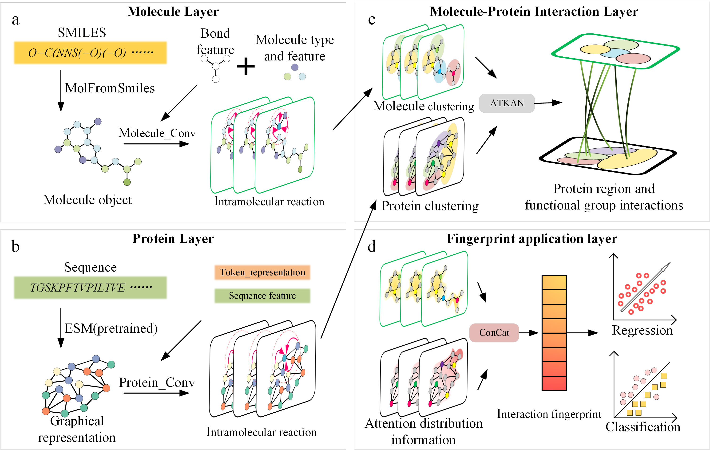

# THIS IS THE OFFICIAL IMPLEMENTATION OF THE GITK CODE


## Requirments 
LINUX or Windows GPU 
```bash
conda env create -n GITK python=3.9
conda activate GITK
pip install -r requirments.txt

```
### Setting Up the GRIT Basic Environment

This guide provides instructions on how to set up the basic environment for [GRIT](https://github.com/LiamMa/GRIT) to ensure smooth execution of its code.

## Datasets Download

Below describe all the datasets that are available on Google Drive ([Dataset](https://drive.google.com/drive/folders/1ZRpnwXtllCP89hjhfDuPivBlarBIXnmu?usp=sharing)).


For more details on the data format, refer to the dataset section of ([PSICHIC](https://github.com/huankoh/PSICHIC/tree/main/dataset)).

## RUN Example
### Regression

```bash
python main.py --datafolder GITK/dataset/pdb2020 --result_path GITK/result/PDB2020_BENCHMARK --regression_task True --device cuda:0
 ```

### Classification 

```bash
python main.py --datafolder GITK/dataset/pdb2020 --result_path GITK/result/PDB2020_BENCHMARK -- --classification_task  True --device cuda:0
 ```

### Functional Effect Classification

```bash
python main.py --datafolder GITK/dataset/pdb2020 --result_path GITK/result/PDB2020_BENCHMARK --mclassification_task 3 --device cuda:0
 ```


### Multi Task

 ```bash
  python main.py --datafolder GITK/dataset/LargeScaleInteractionDataset --result_path GITK/LargeScaleInteractionDataset_MultiTask_Pretrain --lrate 1e-4 --sampling_col pretrain_sampling_weight --regression_task True --mclassification_task 3 --total_iters 300000 --evaluate_step 25000 --device cuda:2
 ```


## Acknowledgments
 

We sincerely appreciate the outstanding contributions of [GRIT](https://github.com/LiamMa/GRIT) and [PSICHIC](https://github.com/huankoh/PSICHIC). Their work has significantly advanced research in this field, providing valuable tools and datasets for the community.
